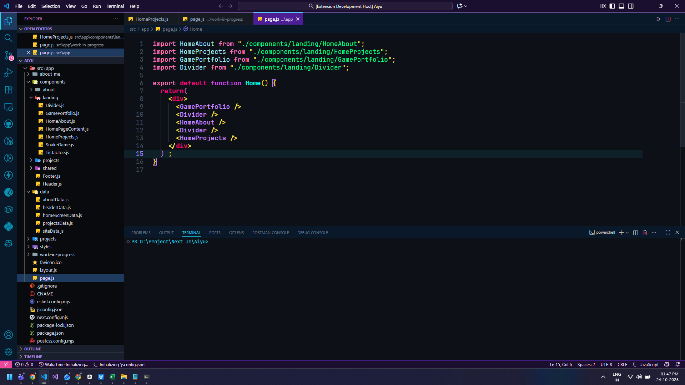

# Neon Cyberpunk Theme

A dark, vibrant, and futuristic theme for Visual Studio Code, inspired by the neon-drenched streets and high-tech aesthetics of the cyberpunk genre.

## Features

- **Deep, immersive dark background:** Reduces eye strain and provides a perfect canvas for vibrant colors.
- **Striking neon accents:** Carefully selected colors for keywords, functions, strings, and variables that pop without being overwhelming.
- **Enhanced readability:** Thoughtful color pairings ensure code is easy to read and navigate.
- **Consistent theming:** Applies across various VS Code UI elements, including the editor, sidebar, activity bar, and terminal.

## Installation

1.  Launch VS Code.
2.  Go to the Extensions view (`Ctrl+Shift+X` or `Cmd+Shift+X` on macOS).
3.  Search for "Neon Cyberpunk".
4.  Click "Install".
5.  Once installed, go to `File > Preferences > Color Theme` (or `Code > Preferences > Color Theme` on macOS) and select "Neon Cyberpunk" from the list.

## Screenshots

## Feedback and Issues

If you encounter any issues or have suggestions for improvements, please feel free to open an issue on the [GitHub repository](https://github.com/Ayaan/neon-cyberpunk/issues) (if applicable).

## Author

[Ayaan](https://aiyu.me)

## License

This theme is licensed under the MIT License.